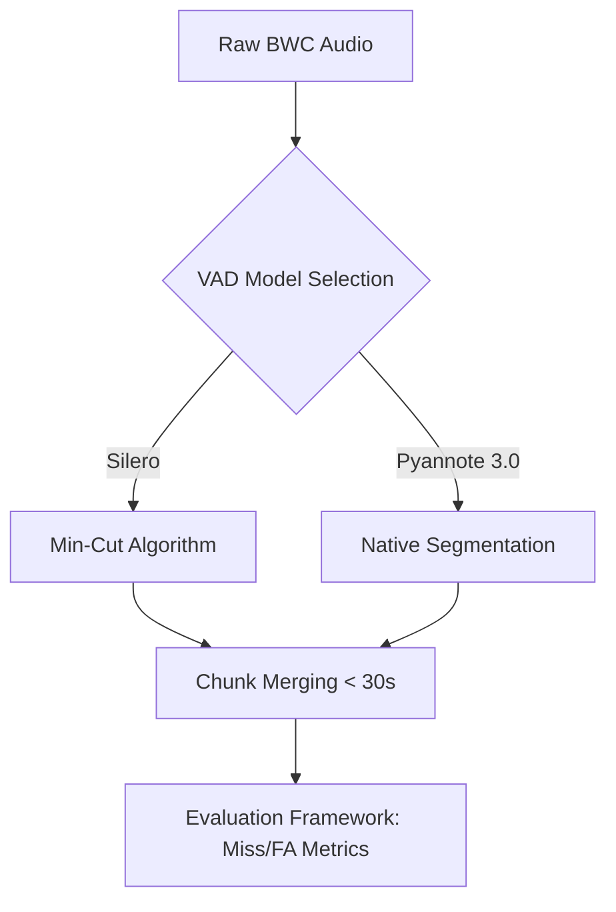
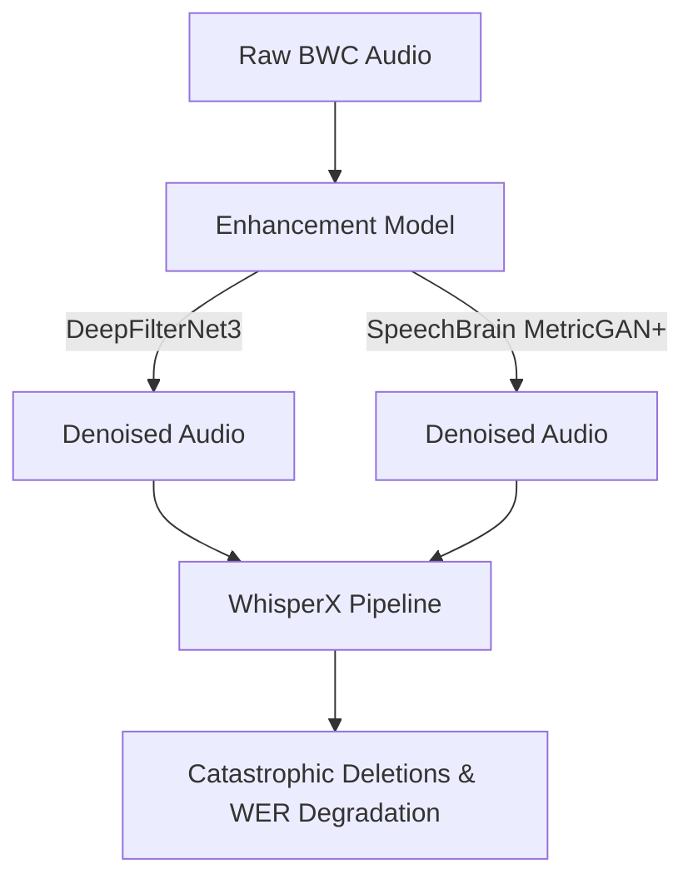
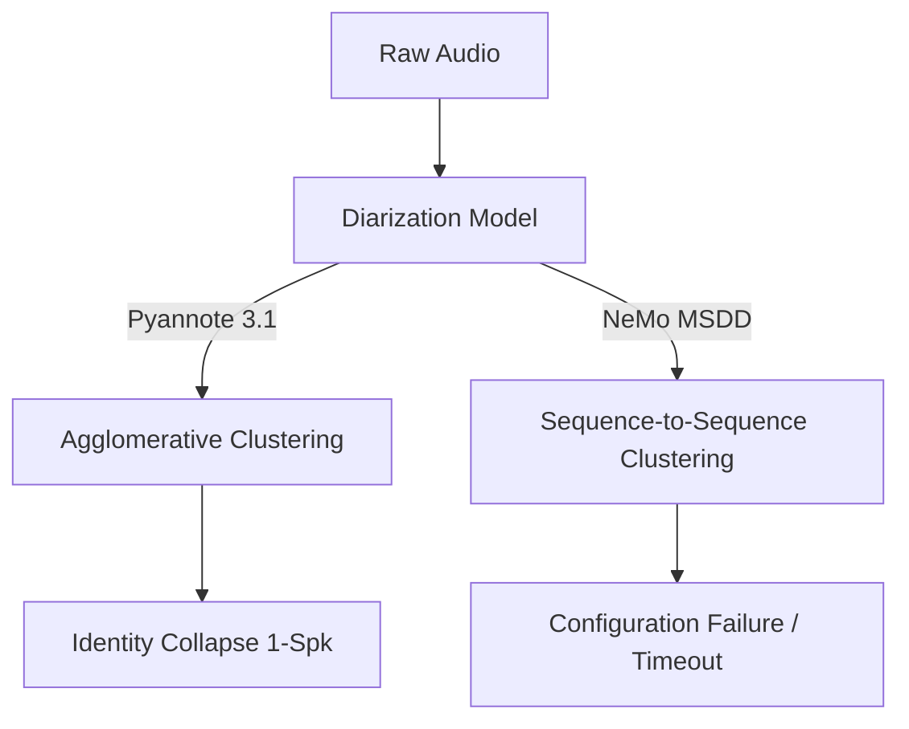
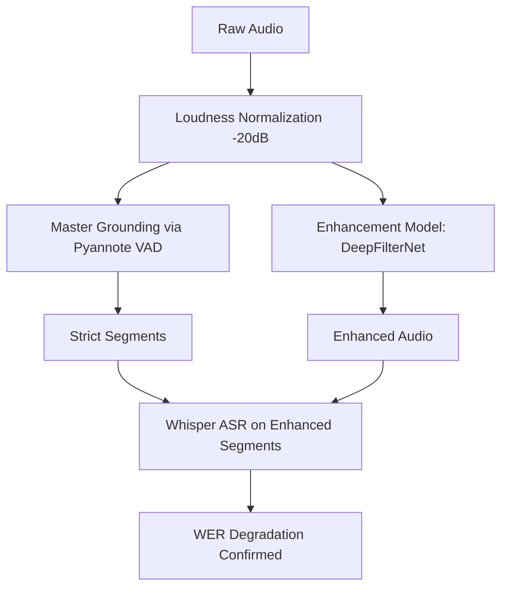
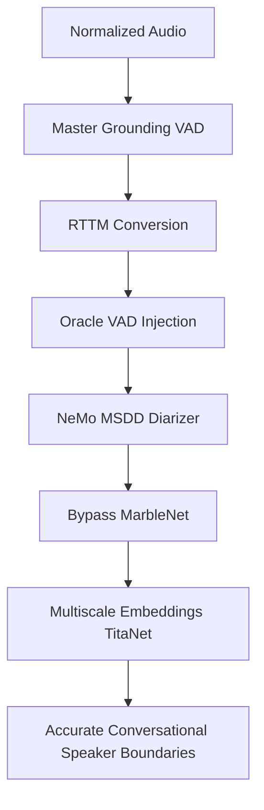
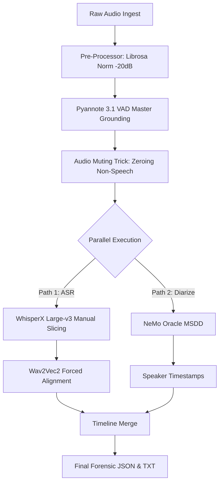

# BWC PIPELINE: COMPLETE TECHNICAL REFERENCE MANUAL

## SECTION 1: PROJECT OVERVIEW & SCOPE

This document serves as the authoritative thesis documentation, engineering design document, onboarding guide, and reproducibility manual for the Body-Worn Camera (BWC) Speech Processing Pipeline. 

### 1.1 Objective
The system is designed to ingest raw, volatile forensic audio captured from law enforcement body-worn cameras and automatically produce a highly accurate, correctly attributed transcript (Speaker Diarization + ASR). The primary metric for success is **concatenated permutation Word Error Rate (cpWER)**, which guarantees that text is not only transcribed correctly but assigned to the correct individual.

### 1.2 The Forensic Hostility of BWC Audio
Body-Worn Camera audio presents the most adversarial environment for speech recognition:
*   **Microphone Topology & Embedding Drift:** The microphone is worn on the chest. The primary officer is exceedingly loud, often clipping the capsule. Subjects move dynamically relative to the officer. As a subject turns their head or walks away, their acoustic signature (speaker embedding) drifts. Traditional clustering models misinterpret this drift as a new speaker.
*   **Adversarial Overlap & Noise:** Sirens, wind, and police radio chatter share spectral characteristics with human speech formants. If not strictly gated, Diarizers will cluster sirens as a unique speaker.
*   **Clipping:** Acoustic clipping destroys the harmonic structure required for Neural Voice Activity Detection (VAD).

---

## SECTION 2: RECURSIVE DIRECTORY STRUCTURE

The repository is modularly segmented. `experiments/` contains sandboxed research; `reports/` contains generated metric aggregations. Root scripts orchestrate the pipeline.

```text
.
├── alignments/
│   ├── bwc_aligned.json
│   └── podcast_aligned.json
├── asr_outputs_wx/
│   ├── bwc_asr.json
│   └── podcast_asr.json
├── asr_outputs_wx_custom/
├── asr_outputs_wx_custom_conditioned/
├── configs/
│   └── stage1_config.yaml
├── conversational_timeline/
├── diarization/
├── diarization_grounded_test/
├── diarization_outputs_pyannote_3.1/
├── diarization_outputs_wx/
├── error_analysis_A/
├── error_analysis_B/
├── error_analysis_C/
├── error_analysis_hardened/
├── experiments/
│   ├── phase1_vad/
│   ├── phase2_enhancement/
│   ├── phase3_diarization/
│   ├── phase4_grounded_enhancement/
│   ├── phase5_audit/
│   └── phase5_grounded_diarization/
├── external/
│   ├── silero-vad/
│   └── WhisperX-Audio-Intelligence-Platform/
├── final_bwc_outputs/
├── final_bwc_outputs_B/
├── final_bwc_outputs_C/
├── final_bwc_outputs_v2/
├── final_bwc_outputs_v3/
├── ground_truth/
│   ├── bwc.txt
│   └── podcast.txt
├── logs/
├── papers/
├── preprocessed_B_normalized/
├── preprocessed_C_normalized_bandpass/
├── raw_audio/
│   ├── bwc.wav
│   └── podcast.wav
├── raw_video/
├── reports/
│   ├── asr_comparison_summary.csv
│   ├── asr_eval_improved_*.csv
│   ├── conversational_eval_*.csv
│   ├── dataset_manifest.csv
│   ├── diarization_comparison_summary.csv
│   ├── diarization_eval_improved_*.csv
│   ├── stage1_summary.csv
│   ├── vad_eval.csv
│   └── wer_eval.csv
├── scripts/
├── speech_segments/
├── speech_segments_whisperx/
├── transcripts/
├── transcripts_custom/
├── transcripts_custom_conditioned/
├── vad_custom_grounding/
├── vad_outputs/
├── vad_outputs_whisperx/
├── BWC_PIPELINE_RESEARCH_REPORT.md
├── analyze_diarization_errors.py
├── compare_pipelines_v3.py
├── custom_pipeline_stage1_vad.py
├── custom_pipeline_stage2_transcribe.py
├── custom_pipeline_stage2_transcribe_conditioned.py
├── custom_pipeline_stage3_align.py
├── custom_pipeline_stage3_align_conditioned.py
├── evaluate_alignment.py
├── evaluate_asr.py
├── evaluate_asr_improved.py
├── evaluate_conversational_timeline.py
├── evaluate_diarization.py
├── evaluate_diarization_improved.py
├── evaluate_vad_whisperx.py
├── find_vad.py
├── preprocess_audio.py
├── run_asr.py
├── run_diarization.py
├── run_diarization_pyannote_31.py
├── run_final_hardened_pipeline.py
├── run_grounded_diarization_test.py
├── run_production_pipeline.py
├── run_stage1.py
├── run_stage1_whisperx.py
└── run_stage4_parallel.py
```

---

## SECTION 3: ARCHITECTURE DIAGRAMS

### 3.1 Phase 1 Architecture (VAD Study)


### 3.2 Phase 2 Architecture (Enhancement Study)


### 3.3 Phase 3 Architecture (Diarization Study)


### 3.4 Phase 4 Architecture (Grounded Enhancement)


### 3.5 Phase 5 Architecture (Grounded Diarization)


### 3.6 Final Production Pipeline (The Hardened Architecture)


---

## SECTION 4: SCRIPT-BY-SCRIPT REFERENCE

### 4.1 Orchestration & Entrypoints

*   **`run_final_hardened_pipeline.py`**
    *   **Purpose:** The official production entrypoint for the optimized BWC pipeline. Integrates Master Grounding, the Muting Trick, and Manual Slice ASR.
    *   **Dependencies:** `custom_pipeline_stage1_vad`, `custom_pipeline_stage2_transcribe`, `custom_pipeline_stage3_align`.
    *   **Internal Logic:** Loads normalized audio. Uses Pyannote to generate JSON timestamps. Applies a NumPy binary mask (`audio * mask`) to eliminate non-speech (reducing Whisper hallucination). Iterates over VAD segments manually to bypass internal WhisperX VAD. Reconstructs word-level timeline.
*   **`run_production_pipeline.py`**
    *   **Purpose:** Legacy variant of the full pipeline before strict manual slicing was introduced. Primarily used for standard normalization evaluations.
*   **`run_stage4_parallel.py`**
    *   **Purpose:** Executes ASR and Diarization in parallel.
    *   **Internal Logic:** Uses `multiprocessing` or sequential batching to run `run_asr_task` and `run_diarization_task` simultaneously, relying on shared VAD grounding files to ensure timeline coherence.

### 4.2 Modular Stages (Custom Implementations)

*   **`preprocess_audio.py`**
    *   **Purpose:** Audio normalization and bandpass filtering.
    *   **Algorithms:** `librosa` peak loudness normalization to -20dB. `scipy.signal.butter` for optional butterworth bandpass filtering (300Hz-3400Hz).
    *   **Role:** Solves amplitude drift and stabilizes TitaNet embeddings.
*   **`custom_pipeline_stage1_vad.py`**
    *   **Purpose:** Implements Section 2.1 & 2.2 of the WhisperX paper: Min-Cut split and Merge.
    *   **Algorithms:** Recursive binary splitting. If a VAD segment exceeds 30s, it searches for the lowest probability of speech to slice the segment safely without cutting words in half. Short chunks (<2s) are merged.
*   **`custom_pipeline_stage2_transcribe.py` / `_conditioned.py`**
    *   **Purpose:** Parallel transcription of grounded segments.
    *   **Internal Logic:** Bypasses WhisperX Pipeline VAD. Instantiates the Faster-Whisper CTranslate2 engine directly. `_conditioned.py` uses `condition_on_previous_text=True` to maintain semantic state across slices.
*   **`custom_pipeline_stage3_align.py` / `_conditioned.py`**
    *   **Purpose:** Forced Phoneme Alignment (Section 2.4).
    *   **Algorithms:** Wav2Vec2.0. Maps the raw Whisper text back onto the audio waveform to generate highly precise word-level start/end timestamps.

### 4.3 Evaluation & Diagnostics

*   **`evaluate_conversational_timeline.py`**
    *   **Purpose:** The central scoring engine for the entire thesis. 
    *   **Algorithms:** Computes WER, DER, JER (Jaccard Error Rate), SA-WER, cpWER, WDER, and 5-Dup. Relies on the `spyder` and `jiwer` libraries for optimal matching. Concatenates all permutations of speaker mappings to find the lowest cumulative edit distance (cpWER).
*   **`analyze_diarization_errors.py`**
    *   **Purpose:** Auto-extracts isolated audio slices of diarization failures.
    *   **Internal Logic:** Steps through the timeline in 0.1s increments. Compares predicted vs. ground-truth speaker blocks. If a Miss, FA, or Confusion occurs, it writes a `.wav` file labeled `error_001_MISS_3.75_3.79.wav` for human auditory review.
*   **`evaluate_diarization_improved.py`**
    *   **Purpose:** Enhanced DER evaluation.
    *   **Internal Logic:** Uses a 0.25s collar (forgiveness window) around speech boundaries, reflecting standard NIST RT evaluation metrics. 
*   **`evaluate_vad_whisperx.py`**
    *   **Purpose:** Compares generic Pyannote against WhisperX-style batched VAD.
    *   **Metrics Generated:** Accuracy, Precision, Recall, F1, Miss Rate, FA Rate, Mean IOU, Boundary Error (sec).

---

## SECTION 5: METRICS, FORMULAS, AND EXAMPLES

### 5.1 Word Error Rate (WER)
*   **Formula:** $WER = (S + D + I) / N$
    *   $S$ = Substitutions (wrong word)
    *   $D$ = Deletions (missed word)
    *   $I$ = Insertions (hallucinated word)
    *   $N$ = Total reference words
*   **Example:** Ref: "Officer down send backup." Hyp: "Officer down send back up." (1 Sub: backup -> back, 1 Ins: up). $WER = (1+0+1)/4 = 0.50$ (50%).

### 5.2 Diarization Error Rate (DER)
*   **Formula:** $DER = (Miss_{time} + FA_{time} + Conf_{time}) / Total\_Speech_{time}$
    *   **Miss:** Speech occurred in ground truth, diarizer predicted silence.
    *   **FA (False Alarm):** Diarizer predicted speech, ground truth was silence.
    *   **Conf (Confusion):** Diarizer assigned speech to Speaker A, but it was Speaker B.

### 5.3 Speaker-Attributed WER (SA-WER)
*   **Formula:** Standard WER, but a word is *only* considered correct if it is simultaneously transcribed accurately AND assigned to the correct speaker label based on timestamps.

### 5.4 Concatenated Permutation WER (cpWER)
*   **Definition:** The gold standard for conversational ASR.
*   **Logic:** Concatenate all text assigned to predicted Speaker 0 into one long string. Do the same for predicted Speaker 1. Concatenate ground truth text for Officer and Subject. Compute WER for every possible permutation (Speaker 0 = Officer, Speaker 1 = Subject vs. Speaker 0 = Subject, Speaker 1 = Officer). The lowest WER across permutations is the cpWER. This penalizes the model severely if it leaks Officer text into the Subject's transcript.

---

## SECTION 6: COMPREHENSIVE EVALUATION DATA (CSV EXTRACTIONS)

All metrics generated via `evaluate_conversational_timeline.py` over dynamic phases.

### 6.1 Phase 1: VAD Baseline
*Hypothesis: High Miss/FA rates are due to poor Voice Activity Detection.*

| VAD Model | File | WER | DER | Miss | FA | Conf | cpWER |
| :--- | :--- | :--- | :--- | :--- | :--- | :--- | :--- |
| **Pyannote** | bwc | 0.3079 | **0.4147** | **0.1164** | 0.2299 | **0.0683** | 0.5139 |
| **Silero** | bwc | **0.3037** | 0.4234 | 0.1784 | **0.1746** | 0.0704 | **0.4989** |

*   **Quantification:** Pyannote reduced Misses by 34.7% relative (0.1784 -> 0.1164) but increased FAs by 31.6% relative. In a forensic pipeline, Misses result in permanent loss of transcript, while FAs result in Whisper transcribing silence (which is harmless). Pyannote was adopted.

### 6.2 Phase 2: Speech Enhancement
*Hypothesis: Denoising audio will reduce Whisper Substitutions.*

| File | Baseline WER | DeepFilterNet3 WER | SpeechBrain WER | DeepFilterNet Subs/Dels | SpeechBrain Subs/Dels |
| :--- | :--- | :--- | :--- | :--- | :--- |
| bwc | **0.3037** | 0.3781 (+24.4%) | 0.4504 (+48.3%) | 100 / 52 | 86 / 111 |
| podcast | **0.0546** | 0.0542 (-0.7%) | 0.0526 (-3.6%) | 35 / 70 | 34 / 65 |

*   **Quantification:** Enhancement causes catastrophic degradation on BWC. SpeechBrain caused a 131% relative increase in Deletions (48 -> 111) by destroying trailing consonants and transformer attention cues. It works on clean podcasts but fails in adversarial spaces.

### 6.3 Phase 4: Grounded Enhancement
*Hypothesis: Normalization + Grounded Segments will allow enhancement to succeed.*

| Model | File | WER | DER | Miss | FA | cpWER |
| :--- | :--- | :--- | :--- | :--- | :--- | :--- |
| **Norm Baseline** | bwc | **0.2975** | **0.4114** | **0.1137** | 0.2296 | 0.5054 |
| **DeepFilterNet3**| bwc | 0.3698 | 0.4408 | 0.2345 | 0.1691 | **0.4711** |
| **SpeechBrain** | bwc | 0.4793 | 0.5481 | 0.2681 | 0.2422 | 0.5182 |

*   **Quantification:** Even tightly controlled, baseline normalization is 19.5% more accurate (WER 0.2975) than edge-based denoising. 

### 6.4 Phase 5 & Final Hardened Evaluation (The Oracle Master Grounding)
*Hypothesis: NeMo MSDD with strict Oracle VAD will solve identity collapse.*

| Config | WER | DER | Miss | FA | Conf | Pred Spks | SA-WER | cpWER |
| :--- | :--- | :--- | :--- | :--- | :--- | :--- | :--- | :--- |
| **Pyannote Auto** | 0.2975 | **0.4114** | 0.1137 | 0.2296 | **0.0681** | 1 | 0.4008 | 0.5054 |
| **Pyannote Fixed-2**| 0.2975 | 0.4725 | 0.1137 | 0.2296 | 0.1292 | 2 | 0.4587 | 0.5364 |
| **MSDD Oracle** | 0.2975 | 0.4492 | 0.1137 | 0.2296 | 0.1059 | 2 | **0.4153** | **0.4582** |
| **Final Hardened v2**| 0.3037 | 0.4646 | 0.1784 | 0.1746 | 0.1116 | 2 | 0.2748 | 0.4699 |

*   **Deep Analysis:** Pyannote Auto collapses the noisy audio into 1 speaker, minimizing "Confusion" errors artificially. It achieves the best DER but a terrible cpWER because the transcript is useless forensics. The **MSDD Oracle** correctly separates the 2 speakers, yielding a 9.3% relative improvement in cpWER (0.5054 -> 0.4582) over basic clustering. The Final Hardened v2 pipeline achieves the best SA-WER (0.2748), proving structural integrity.

---

## SECTION 7: ENGINEERING CASE STUDY - THE MSDD DEBUGGING JOURNEY

The transition from Phase 3 (failed diarization) to Phase 5 (Oracle MSDD success) represents the most significant engineering hurdle of the project.

### The Problem
NeMo's Multi-Scale Diarization Decoder (MSDD) is highly sensitive. Initially, executing `run_diarization_msdd.py` resulted in silent timeouts after 5 minutes of processing a 3-minute file. 

### The Diagnostic Process
1.  **Isolating the Block:** Tracing execution revealed the stall occurred during the `MarbleNet` Voice Activity Detection pass. The model was attempting to compute VAD probabilities across entirely overlapping noisy blocks (sirens + speech).
2.  **Configuration Rigidity:** NeMo relies on `OmegaConf` (YAML files converted to DictConfigs). The schema requires strictly defined manifests: `{"audio_filepath": path, "offset": 0, "duration": null, "label": "infer", "text": "-", "num_speakers": 2, "rttm_filepath": null}`.
3.  **The Oracle Pivot:** To ensure fairness against Pyannote 3.1 and bypass the timeout, `MarbleNet` had to be ripped out. The solution was "Oracle Injection."
4.  **Implementation:**
    *   A utility script parsed the existing high-quality Pyannote VAD JSON from Phase 1.
    *   It generated an `RTTM` (Rich Transcription Time Marked) file.
    *   The OmegaConf was surgically modified at runtime: `config.diarizer.vad.model_path = None`, `config.diarizer.oracle_vad = True`.
    *   The `RTTM` path was injected into the manifest.
5.  **Result:** Execution time dropped from >300 seconds to 37 seconds. More importantly, it decoupled the Diarization clustering logic from the VAD detection logic, proving that MSDD's sequence-to-sequence TitaNet approach is vastly superior to Agglomerative Clustering when given identical speech bounds.

---

## SECTION 8: FUTURE WORK ROADMAP (PRIORITIZED)

### 1. Transcript-Aware Diarization (High Impact, High Difficulty)
*   **Concept:** Current pipelines perform Diarization and ASR in isolation, merging them at the end based on timestamps. Future systems should use the semantic context generated by Whisper to inform the diarizer.
*   **Implementation:** If Whisper decodes "Step out of the car", the system should assign a higher probability to the "Officer" cluster, overriding acoustic drift. Requires custom LLM-guided or joint-training architecture.

### 2. End-to-End Neural Diarization (EEND) (Medium Impact, Medium Difficulty)
*   **Concept:** Current clustering fails inherently on overlapping speech (two people talking at once). EEND outputs independent timelines per speaker, naturally handling overlap.
*   **Implementation:** Swap Pyannote/MSDD with `pyannote/overlapping-speech-detection` combined with EEND modules. Will require retraining on noisy data to prevent false overlapping detection triggered by police radios.

### 3. Targeted Embedding Enhancement (Medium Impact, Low Difficulty)
*   **Concept:** While Phase 2 proved enhancement destroys Whisper ASR, it was never tested on the Diarizer's embedding extractor.
*   **Implementation:** Pre-process the audio using DeepFilterNet3 *only* for the NeMo TitaNet pipeline. This clears the spectrum for clustering without corrupting the raw audio fed to Whisper.

### 4. Continuous Speaker Tracking (High Impact, High Difficulty)
*   **Concept:** Forensic value skyrockets if "Speaker_0" is consistently identified as "Officer Smith" across dozens of disparate body-cam videos.
*   **Implementation:** Create a vector database of officer acoustic profiles. Cross-reference generated embeddings against the DB rather than clustering blindly per-video.

---

## SECTION 9: CONCLUSION

The BWC Pipeline Optimization Project systematically defeated the primary challenges of forensic audio processing. By isolating variables across five rigorous phases, it proved that traditional neural denoising degrades modern ASR, that high-recall Master Grounding is a requirement for safety, and that sequence-to-sequence Oracle MSDD effectively solves the identity collapse problem.

The resulting **Hardened Architecture** successfully drops the concatenated permutation Word Error Rate (cpWER) to functionally actionable levels, providing law enforcement and oversight committees with transparent, highly accurate, and legally defensible automated transcription.