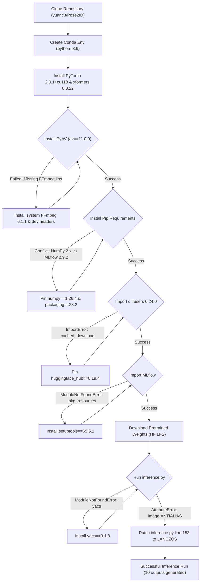
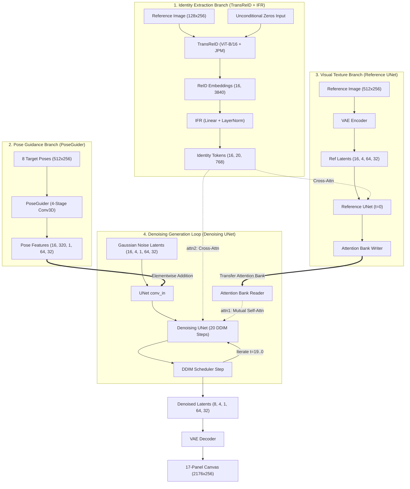
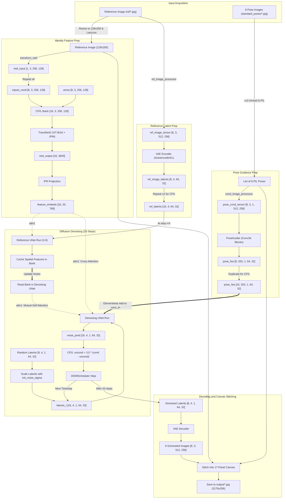

# Running Pose2ID / IPG Repository

A Comprehensive Technical Record of Setup, Debugging, Architecture, and Pretrained Inference on an NVIDIA GeForce RTX 4090 (24 GB)

---

## 1. Document Title and Purpose

### 1.1 Overview and Objective
This document provides an exhaustive, reproducible engineering record of setting up, debugging, and executing pretrained inference for the **Pose2ID / IPG** repository on a local Linux workstation (WSL2 Ubuntu) equipped with an **NVIDIA GeForce RTX 4090 (24 GB)**.

Pose2ID originates from the CVPR 2025 research paper:
> **"From Poses to Identity: Training-Free Person Re-Identification via Feature Centralization"**  
> *Chao Yuan, Guiwei Zhang, Changxiao Ma, Tianyi Zhang, Guanglin Niu (Beihang University)*  
> Paper: [arXiv:2503.00938](https://arxiv.org/abs/2503.00938) | Repository: [github.com/yuanc3/Pose2ID](https://github.com/yuanc3/Pose2ID)

The core insight of Pose2ID is that person re-identification (ReID) performance is severely degraded by intra-class pose variations across camera viewpoints. Instead of retraining ReID backbones, Pose2ID proposes **Feature Centralization**:
1. **IPG (Identity-Guided Pedestrian Generation)**: Generates high-fidelity images of a target identity under standardized reference poses, extracting features from these synthetic samples and aggregating them with the query/gallery feature vector to "centralize" identity representation.
2. **NFC (Neighbor Feature Centralization)**: Discovers potential positive matches from neighborhood graph structures to centralize features.

### 1.2 Scope of Reproduction
This technical report focuses strictly on **pretrained IPG inference** rather than training models from scratch:
- We execute `IPG/inference.py` using official pretrained checkpoint weights provided by the authors on Hugging Face (`yuanc3/Pose2ID`).
- No model weights were trained or fine-tuned during this procedure.
- The pipeline synthesizes pose-transferred pedestrian images given arbitrary reference images and target pose skeletons.

### 1.3 Inputs and Outputs
The inference pipeline takes two directories of visual inputs:
1. **Reference Images (`IPG/ref/`)**: 10 reference images provided by the authors, consisting of 5 visible-light RGB images (`rgb1.jpg` to `rgb5.jpg`) and 5 infrared images (`ir1.jpg` to `ir5.jpg`).
2. **Standard Target Poses (`IPG/standard_poses/`)**: 8 representative 2D skeletal body poses (`1.jpg` to `8.jpg`), containing 18-keypoint openpose/DWPose skeletons rendered on black backgrounds.

The pipeline outputs:
- **Output Directory (`IPG/output/`)**: 10 composite evaluation canvases (`ir1.jpg` to `ir5.jpg` and `rgb1.jpg` to `rgb5.jpg`). Each image is a single wide canvas of dimension **2176 × 256 pixels** containing **17 panels**:
  - Panel 0: The resized reference image.
  - Panels 1–16: 8 alternating pairs of `[Target Pose Skeleton, Synthesized Person Image in That Pose]`.

### 1.4 Architectural Component Roles
The IPG generation framework couples person ReID representations with latent diffusion models via the following core modules:
- **Reference Image**: The visual ground-truth source providing identity attributes, face geometry, clothing textures, colors, and camera modality (RGB vs. IR).
- **Target Pose**: An 18-keypoint skeleton map dictating the exact spatial geometry, posture, and limb orientation for the synthesized person.
- **Identity Representation (TransReID)**: A Vision Transformer (`vit_base_patch16_224_TransReID`) with Jigsaw Patch Module (JPM) that extracts a compact, discriminative 3840-dimensional identity embedding invariant to background noise.
- **IFR (Identity Feature Representation)**: A trainable projection layer (Linear + LayerNorm) that maps the 3840-d TransReID feature vector into 20 cross-attention prompt tokens of dimension 768 (`[B, 20, 768]`), effectively substituting for text prompt embeddings in Stable Diffusion.
- **Stable Diffusion (SD v1.5)**: Provides the generative latent diffusion foundation (`UNet2DConditionModel` architecture and `AutoencoderKL` latent space).
- **Reference UNet**: A modified 2D UNet that processes the latent representation of the reference image at timestep 0 and stores intermediate spatial self-attention features into a memory bank (`ReferenceAttentionControl` in `write` mode).
- **PoseGuider**: A 4-stage convolutional downsampling subnetwork that encodes the 3-channel pose skeleton into a 320-channel feature map matching the UNet latent resolution (`[B, 320, 1, H//8, W//8]`).
- **Denoising UNet**: A modified UNet with motion module hooks disabled that denoises random Gaussian noise over 20 DDIM steps. It incorporates identity via three distinct pathways:
  1. *Pose Guidance*: Direct element-wise addition of `PoseGuider` features to the initial convolution output.
  2. *Identity Prompt Guidance*: Cross-attention (`attn2`) attending to the 20 IFR identity tokens.
  3. *Detailed Visual Appearance Guidance*: Mutual self-attention (`attn1`) reading stored spatial features from the `Reference UNet` memory bank (`ReferenceAttentionControl` in `read` mode).

---

## 2. Hardware and Environment

### 2.1 Hardware and OS Specifications
All setup, dependency resolution, checkpoint staging, and inference were executed on the following workstation environment:

| Component | Specification |
| :--- | :--- |
| **Operating System** | Linux (Ubuntu on WSL2 / Linux 6.6 kernel) |
| **Host Platform** | x86_64 workstation |
| **GPU** | NVIDIA GeForce RTX 4090 |
| **GPU VRAM** | 24,564 MiB (24 GB GDDR6X) |
| **NVIDIA Driver Version** | 595.71.05 |
| **Driver Reported CUDA** | 13.2 |
| **PyTorch CUDA Build** | 11.8 (`torch==2.0.1+cu118`) |
| **Python Version** | Python 3.9.25 (via Miniconda) |
| **Conda Environment** | `pose2id` |
| **Repository Path** | `/home/priyanka/chaitanya/Pose2ID` |

### 2.2 CUDA Driver vs. CUDA Runtime Architecture
A critical technical distinction in this environment is the relationship between the driver-level CUDA version and the PyTorch runtime:
- Running `nvidia-smi` outputs `CUDA Version: 13.2`. This reflects the **maximum CUDA API version supported by the installed NVIDIA display driver (595.71.05)**.
- PyTorch was installed as a precompiled wheel targeting **CUDA 11.8**:
  ```bash
  torch==2.0.1+cu118
  torchvision==0.15.2+cu118
  ```
- **Why this works seamlessly**: The NVIDIA Linux user-mode driver (`libcuda.so.1`) provides binary backward compatibility. Any NVIDIA driver supporting CUDA 13.2 automatically supports earlier CUDA runtime APIs, including CUDA 11.8. PyTorch bundles its own CUDA 11.8 runtime libraries (`libcudart.so`, cuDNN, cuBLAS) inside the Python wheel package. At no point was PyTorch compiled against CUDA 13.2.

### 2.3 GPU Verification
Executing PyTorch verification inside the `pose2id` environment confirmed proper hardware initialization:
```bash
$ python -c "import torch; print('CUDA available:', torch.cuda.is_available()); print('GPU:', torch.cuda.get_device_name(0)); print('Torch version:', torch.__version__)"
CUDA available: True
GPU: NVIDIA GeForce RTX 4090
Torch version: 2.0.1+cu118
```

---

## 3. Original Repository Requirements

### 3.1 Original Dependency Manifest
The author-provided dependency manifest in `IPG/requirements.txt` contains 20 lines:

```text
accelerate==0.21.0
av==11.0.0
diffusers==0.24.0
einops==0.4.1
matplotlib==3.10.1
mlflow==2.9.2
numpy==2.2.3
omegaconf==2.2.3
onnxruntime_gpu==1.16.3
opencv_contrib_python==4.8.1.78
opencv_python==4.8.1.78
Pillow==9.5.0
Pillow==11.1.0
safetensors==0.5.3
torch==2.0.1
torchvision==0.15.2
tqdm==4.66.1
transformers==4.30.2
xformers==0.0.22
```

### 3.2 Inconsistencies and Failure Modes Encountered
Attempting to install and run the repository using the exact original manifest in a clean Python 3.9 environment triggered multiple resolution and runtime errors:

1. **Duplicate Pillow Specifications**:
   - `IPG/requirements.txt` lists both `Pillow==9.5.0` (line 12) and `Pillow==11.1.0` (line 13). Pip resolves to the latter, but the duplicate creates ambiguity.
2. **matplotlib Incompatibility with Python 3.9**:
   - `matplotlib==3.10.1` requires Python >= 3.10; binary wheels for Python 3.9 do not exist on PyPI for this release.
3. **NumPy 2.2.3 Unavailable for Python 3.9**:
   - `numpy==2.2.3` does not provide wheels or support for Python 3.9 on standard index mirrors.
4. **NumPy 2.x ABI Conflict with MLflow 2.9.2**:
   - Installing `numpy>=2.0.0` breaks `mlflow==2.9.2`. MLflow's package metadata enforces `numpy<2`, causing pip backtrack loops or runtime C-API binary incompatibility errors.
5. **Missing `yacs` Dependency**:
   - Neither `requirements.txt` nor the README mentions `yacs`. However, TransReID configurations are serialized as `yacs.config.CfgNode` instances. `IPG/cfg_transreid.pkl` cannot be unpickled without `yacs` installed.
6. **`diffusers` vs. Modern `huggingface_hub` API Breakage**:
   - `diffusers==0.24.0` imports `cached_download` from `huggingface_hub`:
     ```python
     from huggingface_hub import cached_download
     ```
   - In modern `huggingface_hub` releases (>= 0.20.0, e.g. 0.36.2), `cached_download` was removed. This causes a fatal `ImportError` upon importing `diffusers`.
7. **`mlflow` vs. Modern `packaging` Conflict**:
   - `mlflow==2.9.2` requires `packaging<24,>=17.2`. Installing modern `packaging` (such as 25.0) causes immediate package resolution failure.
8. **Missing `pkg_resources` Interface**:
   - `mlflow==2.9.2` imports the legacy `pkg_resources` interface provided by `setuptools`. In bare-bones virtual environments lacking `setuptools` (or with setuptools >= 70 where `pkg_resources` is decoupled), importing MLflow crashes with `ModuleNotFoundError: No module named 'pkg_resources'`.

---

## 4. Cleaned / Final Requirements

### 4.1 Repository Cleaned File: `IPG/requirements_pose2id.txt`
To resolve package conflicts, the cleaned manifest `IPG/requirements_pose2id.txt` was created:

```text
accelerate==0.21.0
av==11.0.0
diffusers==0.24.0
einops==0.4.1
matplotlib==3.9.4
mlflow==2.9.2
numpy==1.26.4
omegaconf==2.2.3
onnxruntime_gpu==1.16.3
opencv_contrib_python==4.8.1.78
opencv_python==4.8.1.78
Pillow==11.1.0
safetensors==0.5.3
torch==2.0.1
torchvision==0.15.2
tqdm==4.66.1
transformers==4.30.2
xformers==0.0.22
```

### 4.2 Deviations and Rationale

| Package | Original Version | Final Version | Technical Rationale |
| :--- | :--- | :--- | :--- |
| `matplotlib` | `3.10.1` | `3.9.4` | `3.10.1` dropped Python 3.9 support. `3.9.4` is the latest stable release supporting Python 3.9. |
| `numpy` | `2.2.3` | `1.26.4` | Downgraded to highest NumPy 1.x release to satisfy `mlflow==2.9.2` constraint (`numpy<2`) and preserve C ABI stability with PyTorch 2.0.1. |
| `Pillow` | `9.5.0` & `11.1.0` | `11.1.0` | Removed duplicate line; standardized on `11.1.0`. |

### 4.3 Additional Compatibility and Runtime Packages Installed
Four critical packages were installed manually in the `pose2id` environment to resolve runtime failures discovered during execution:

| Package | Installed Version | Reason for Installation | Discovery Stage |
| :--- | :--- | :--- | :--- |
| `huggingface_hub` | `0.19.4` | Provides deprecated `cached_download` required by `diffusers==0.24.0`. | Script Import |
| `packaging` | `23.2` | Satisfies `mlflow==2.9.2` requirement (`packaging<24,>=17.2`). | Pip Resolver |
| `setuptools` | `69.5.1` | Provides legacy `pkg_resources` API imported by `mlflow==2.9.2`. | Script Import |
| `yacs` | `0.1.8` | Enables unpickling of `IPG/cfg_transreid.pkl` (`yacs.config.CfgNode`). | First Inference Attempt |

---

## 5. Step-by-Step Setup History

A chronological log of all setup and troubleshooting stages:



### 5.1 Clone Repository
```bash
cd ~/chaitanya
git clone https://github.com/yuanc3/Pose2ID
cd Pose2ID
```

### 5.2 Create Conda Environment
Python 3.9 was selected because the repository author developed with Python 3.9, and the binary dependencies (`torch 2.0.1+cu118`, `xformers 0.0.22`, `onnxruntime-gpu 1.16.3`) are stable under 3.9:
```bash
conda create -n pose2id python=3.9 -y
conda activate pose2id
```

### 5.3 Install PyTorch CUDA Stack
PyTorch 2.0.1 and torchvision 0.15.2 were installed from the official PyTorch CUDA 11.8 index, followed by xformers 0.0.22:
```bash
pip install torch==2.0.1+cu118 torchvision==0.15.2+cu118 --extra-index-url https://download.pytorch.org/whl/cu118
pip install xformers==0.0.22
```

### 5.4 FFmpeg and PyAV Resolution
Installing `av==11.0.0` initially failed because the underlying C library headers for FFmpeg were absent from the Linux host. The required development headers were installed via `apt`:
```bash
sudo apt-get update
sudo apt-get install -y ffmpeg libavcodec-dev libavformat-dev libavutil-dev libswscale-dev libavdevice-dev libavfilter-dev
```
Host FFmpeg configuration established:
- FFmpeg: `6.1.1-3ubuntu5`
- libavformat: `60.16.100`
`pip install av==11.0.0` subsequently compiled and linked without error.

### 5.5 Dependency Resolver Fix: NumPy and MLflow
Attempting to install `mlflow==2.9.2` alongside `numpy==2.0.2` or `2.2.3` threw a pip dependency conflict because MLflow specifies `numpy<2`. To satisfy all requirements without introducing binary incompatibilities, NumPy was pinned:
```bash
pip install numpy==1.26.4
```

### 5.6 `huggingface_hub` Compatibility Fix
With modern `huggingface_hub==0.36.2`, executing `import diffusers` failed with:
```text
ImportError: cannot import name 'cached_download' from 'huggingface_hub'
```
`diffusers==0.24.0` was designed against the older `huggingface_hub` API. Pinned to the compatible release:
```bash
pip install huggingface_hub==0.19.4
```

### 5.7 `packaging` Downgrade
A later dependency pulled in `packaging==25.0`, triggering:
```text
ERROR: pip's dependency resolver does not currently take into account all the packages that are installed.
mlflow 2.9.2 requires packaging<24,>=17.2, but you have packaging 25.0 which is incompatible.
```
Fixed by explicitly installing:
```bash
pip install packaging==23.2
```

### 5.8 `pkg_resources` / `setuptools` Fix
Importing MLflow failed at startup with:
```text
ModuleNotFoundError: No module named 'pkg_resources'
```
MLflow 2.9.2 relies on `pkg_resources` (historically bundled in `setuptools`). Fixed by installing:
```bash
pip install setuptools==69.5.1
```

### 5.9 Missing `yacs` Installation
Running `python inference.py` failed during configuration deserialization:
```text
ModuleNotFoundError: No module named 'yacs'
```
`IPG/cfg_transreid.pkl` is a serialized `yacs.config.CfgNode` object. Installed:
```bash
pip install yacs==0.1.8
```

### 5.10 Pillow Deprecation Fix (`Image.ANTIALIAS`)
Inference progressed past model loading but aborted when processing the first reference image (`rgb1.jpg`):
```text
AttributeError: module 'PIL.Image' has no attribute 'ANTIALIAS'
```
**Exact Location**: `IPG/inference.py`, line 153, inside `log_validation()`:
```python
# ORIGINAL (line 153):
rgb_img = img_ref.resize((128, 256), Image.ANTIALIAS)

# PATCHED (line 153):
rgb_img = img_ref.resize((128, 256), Image.Resampling.LANCZOS)
```
In Pillow 10.0.0+, `Image.ANTIALIAS` was removed in favor of `Image.Resampling.LANCZOS`. Modifying line 153 permanently resolved the failure.

---

## 6. Model Downloads

Three distinct sets of model checkpoints are required for inference.

### 6.1 IPG Pretrained Checkpoints
- **Hugging Face Repository**: `https://huggingface.co/yuanc3/Pose2ID`
- **Total Download Size**: ~7.01 GiB (~7.53 GB) across 5 weights:
  - `denoising_unet.pth` (3,438,374,293 bytes / ~3.3 GB)
  - `reference_unet.pth` (3,438,323,817 bytes / ~3.3 GB)
  - `transformer_20.pth` (414,700,189 bytes / ~396 MB)
  - `IFR.pth` (235,998,939 bytes / ~226 MB)
  - `pose_guider.pth` (2,065,001 bytes / ~2.0 MB)

#### Git LFS Interruption and Resolution
The initial clone was interrupted during the large LFS download phase:
```bash
git clone https://huggingface.co/yuanc3/Pose2ID pretrained
```
This left small Git LFS text pointer files (130 bytes each) on disk instead of the binary `.pth` weights. The download was completed cleanly by running:
```bash
cd IPG/pretrained
git reset --hard HEAD
```
Git LFS automatically re-authenticated and streamed all five binary weights to completion.

#### Directory Nesting Correction
In the upstream Hugging Face repository, the authors committed the `.pth` files inside an internal subdirectory also named `pretrained/`. Consequently, cloning to `IPG/pretrained` created:
```text
IPG/pretrained/pretrained/*.pth
```
However, `IPG/inference.py` specifies:
```python
denoising_unet.load_state_dict(
    torch.load(os.path.join(args.ckpt_dir, "denoising_unet.pth"), map_location="cpu")
)
```
When invoked with `--ckpt_dir pretrained`, the script looks in `IPG/pretrained/*.pth`. The files were therefore moved one level up:
```bash
mv IPG/pretrained/pretrained/*.pth IPG/pretrained/
rmdir IPG/pretrained/pretrained
```

### 6.2 Stable Diffusion v1.5 Base Model
- **Hugging Face Repository**: `https://huggingface.co/stable-diffusion-v1-5/stable-diffusion-v1-5`
- **Location on Disk**: `/home/priyanka/chaitanya/Pose2ID/stable-diffusion-v1-5`
- **Relative Path from `IPG/`**: `../stable-diffusion-v1-5` (as specified in `IPG/configs/inference.yaml`)
- **Crucial Clarification on Checkpoint Usage**:
  Although the complete SD v1.5 repository includes text encoders, tokenizers, safety checkers, and monolithic weights (`v1-5-pruned.ckpt`, `v1-5-pruned.safetensors`, totaling over 23 GB), **the IPG inference script only loads the 2D UNet submodule** from `../stable-diffusion-v1-5/unet` (lines 259–272). Text encoders, CLIP tokenizers, and standalone `.ckpt` checkpoints are never accessed. Furthermore, immediately after loading the base UNet architecture, `reference_unet.pth` and `denoising_unet.pth` overwrite the weights with `strict=True`.

### 6.3 VAE (Variational Autoencoder)
- **Hugging Face Repository**: `https://huggingface.co/stabilityai/sd-vae-ft-mse`
- **Location on Disk**: `/home/priyanka/chaitanya/Pose2ID/sd-vae-ft-mse`
- **Relative Path from `IPG/`**: `../sd-vae-ft-mse` (as specified in `IPG/configs/inference.yaml`)
- **Model Files Used**: `config.json` and `diffusion_pytorch_model.bin` (~335 MB). Loaded via `AutoencoderKL.from_pretrained(cfg.vae_model_path)`.

---

## 7. Final Directory Structure

The complete filesystem hierarchy required for inference:

```text
Pose2ID/
├── running_the_repo.md            # Comprehensive technical record (this document)
├── README.md                      # Upstream repository documentation
├── LICENSE                        # MIT License
├── ID2.py                         # Identity density metric utility
├── NFC.py                         # Neighbor feature centralization utility
├── demo/                          # Upstream evaluation scripts
├── figs/                          # Diagram figures
├── sd-vae-ft-mse/                 # Cloned VAE model repository
│   ├── config.json
│   ├── diffusion_pytorch_model.bin
│   └── diffusion_pytorch_model.safetensors
├── stable-diffusion-v1-5/         # Cloned SD v1.5 model repository
│   ├── unet/                      # UNet submodule loaded by IPG
│   │   ├── config.json
│   │   └── diffusion_pytorch_model.bin
│   ├── text_encoder/              # (Present on disk; unused by IPG inference)
│   ├── tokenizer/                 # (Present on disk; unused by IPG inference)
│   └── vae/                       # (Present on disk; overridden by sd-vae-ft-mse)
└── IPG/                           # Core inference execution directory
    ├── cfg_transreid.pkl          # Pickled yacs.config.CfgNode for TransReID
    ├── inference.py               # Main inference script (patched line 153)
    ├── requirements.txt           # Upstream pip requirements
    ├── requirements_pose2id.txt   # Working pip requirements
    ├── configs/
    │   └── inference.yaml         # Inference hyperparameters and paths
    ├── pretrained/                # Checked-out IPG model weights (~7.1 GB)
    │   ├── denoising_unet.pth     # Fine-tuned 3D denoising UNet
    │   ├── reference_unet.pth     # Fine-tuned 2D reference UNet
    │   ├── IFR.pth                # Identity Feature Representation projection
    │   ├── pose_guider.pth        # Pose skeleton downsampling encoder
    │   └── transformer_20.pth     # TransReID ViT backbone weights
    ├── ref/                       # Reference query images (10 files)
    │   ├── ir1.jpg ... ir5.jpg    # 5 infrared pedestrian samples
    │   └── rgb1.jpg ... rgb5.jpg  # 5 RGB pedestrian samples
    ├── standard_poses/            # Target skeleton poses (8 files)
    │   ├── 1.jpg ... 8.jpg        # 8 openpose/DWPose 18-keypoint body skeletons
    ├── output/                    # Generated composite evaluation canvases
    │   ├── ir1.jpg ... ir5.jpg    # 17-panel synthesized canvases for IR
    │   └── rgb1.jpg ... rgb5.jpg  # 17-panel synthesized canvases for RGB
    ├── reidmodel/                 # TransReID model definition package
    │   ├── loss/                  # Metric learning losses
    │   ├── trainsreid/            # ViT backbones with JPM module
    │   └── vision_transformer.py  # Vision Transformer implementation
    └── src/                       # Custom diffusers modules
        ├── models/                # UNet2D, UNet3D, PoseGuider, MutualSelfAttention
        ├── pipelines/             # Pose2ImagePipeline definition
        └── utils/                 # Random seeding and file importing utilities
```

---

## 8. `inference.py` — Complete Code Walkthrough

Every class and function in `IPG/inference.py` is documented below in execution order:

### 8.1 Class: `Net(nn.Module)`
- **Line Range**: 31–81
- **Purpose**: A PyTorch composite model wrapper designed primarily for distributed training (wrapping submodules so Hugging Face `Accelerator` and DistributedDataParallel can manage gradients and checkpointing across components).
- **Constructor Arguments**:
  - `reid_net`: The TransReID Vision Transformer model.
  - `ifr`: The `IFR` identity projection module.
  - `reference_unet`: `UNet2DConditionModel` for reference image feature extraction.
  - `denoising_unet`: `UNet3DConditionModel` for diffusion denoising.
  - `pose_guider`: `PoseGuider` convolutional network.
  - `reference_control_writer`: `ReferenceAttentionControl` in `write` mode.
  - `reference_control_reader`: `ReferenceAttentionControl` in `read` mode.
- **`forward()` Arguments**: `(noisy_latents, timesteps, ref_image_latents, feature_embeds, pose_img, uncond_fwd=False)`
- **Behavior**: Encodes `pose_img` via `self.pose_guider`, computes identity features via `self.reid_net` and `self.ifr`, executes `reference_unet` at timestep 0, copies attention caches via `reference_control_reader.update(reference_control_writer)`, and evaluates `denoising_unet`.
- **Role in Pretrained Inference**: In `inference.py`, `Net` is instantiated at line 333, but **its `forward()` method is never executed during inference**. Instead, `main()` passes `net` into `log_validation()`, which unwraps `net` to extract its constituent sub-modules (`reference_unet`, `denoising_unet`, `pose_guider`, `ifr`) and passes them into `Pose2ImagePipeline`.

### 8.2 Class: `RectScale(object)`
- **Line Range**: 83–93
- **Purpose**: A deterministic PIL image transformation callable that resizes an image to an exact rectangular aspect ratio `(height, width)`.
- **Inputs**: `img` (PIL Image).
- **Outputs**: Resized PIL Image of dimensions `(self.width, self.height)`.
- **Role in Pipeline**: Used within `transform_reid` (lines 125–130) as `RectScale(256, 128)` to ensure all person crops entering TransReID match the standard ReID input aspect ratio of 256 (height) × 128 (width).

### 8.3 Function: `log_validation(...)`
- **Line Range**: 95–207
- **Purpose**: The core execution engine for validation and batch inference. It iterates over all reference images in `args.ref_dir`, pairs each reference with all target poses in `args.pose_dir`, invokes `Pose2ImagePipeline`, and stitches the results into wide composite canvases.
- **Inputs**:
  - `reid_net`: Initialized TransReID model.
  - `vae`: Loaded `AutoencoderKL` instance.
  - `net`: Wrapped `Net` instance.
  - `scheduler`: `DDIMScheduler` instance.
  - `accelerator`: Hugging Face `Accelerator` context.
  - `width`: Target generation width (256, from `cfg.data.train_height`).
  - `height`: Target generation height (512, from `cfg.data.train_width`).
  - `generator`: Seeded `torch.Generator`.
- **Detailed Step-by-Step Flow**:
  1. *Unwrap Models* (lines 105–109): Unwraps `net` to access `reference_unet`, `denoising_unet`, `pose_guider`, and `ifr`.
  2. *Build Pipeline* (lines 115–122): Instantiates `Pose2ImagePipeline` with `vae`, `reference_unet`, `denoising_unet`, `pose_guider`, and `scheduler`, transferring it to `accelerator.device`.
  3. *Set Up Transforms* (lines 124–130): Defines `transform_reid` with `Normalize(mean=[0.5, 0.5, 0.5], std=[0.5, 0.5, 0.5])` and `RectScale(256, 128)`.
  4. *Enumerate Files* (lines 137–143): Lists reference images from `args.ref_dir` and target poses from `args.pose_dir`.
  5. *Reference Processing Loop* (lines 148–207): For each reference image:
     - Resizes reference image to `(128, 256)` via `Image.Resampling.LANCZOS` (line 153).
     - Converts to tensor and normalizes via `transform_reid` -> shape `[1, 3, 256, 128]`.
     - Collects `batch_size = 8` pose images and duplicates the reference tensor 8 times into `inputs_list`.
     - *Classifier-Free Guidance Stacking* (lines 171–173):
       ```python
       inputs_list = torch.cat(inputs_list, dim=0)          # shape [8, 3, 256, 128]
       zeros_input = torch.zeros_like(inputs_list).cuda()   # shape [8, 3, 256, 128]
       inputs_list = torch.cat([zeros_input, inputs_list], dim=0) # shape [16, 3, 256, 128]
       ```
     - Evaluates TransReID on the 16 inputs (`cam_label=0`, `view_label=1`) -> `reid_output` shape `[16, 3840]`.
     - Passes `reid_output` through `ifr` -> `feature_embeds` shape `[16, 20, 768]`.
     - Calls `pipe(...)` over 20 inference steps with `guidance_scale=3.5` -> output tensor `image` shape `[8, 3, 1, 512, 256]`.
     - *Canvas Stitching* (lines 188–202): Allocates a white PIL canvas of width `(1 + 8*2) * 128 = 2176` and height `256`. Pastes the resized reference at `x=0`. For each pose `i`, pastes target pose at `x = (i*256 + 128)` and generated person at `x = (i*256 + 256)`.
     - Saves composite image to `os.path.join(out_dir, ref_name)`.

### 8.4 Class: `IFR(nn.Module)`
- **Line Range**: 208–221
- **Purpose**: **Identity Feature Representation** module. Transforms the high-dimensional spatial-part feature representation produced by TransReID into sequential cross-attention prompt tokens compatible with the Stable Diffusion UNet.
- **Architecture**:
  - `self.num = 20` (sequence length of virtual prompt tokens).
  - `self.proj_motion = nn.Linear(3840, 20 * 768)`: Linear projection from 3840 dimensions (1 global + 4 local JPM parts of 768-d each) to 15,360 dimensions.
  - `self.norm_motion = nn.LayerNorm(768)`: Normalizes each 768-d token independently.
- **Forward Operation**:
  ```python
  encoder_hidden_states = self.proj_motion(encoder_hidden_states)
  encoder_hidden_states = rearrange(encoder_hidden_states, 'b (n d) -> b n d', n=20)
  encoder_hidden_states = self.norm_motion(encoder_hidden_states)
  ```
- **Tensor Input/Output**: Input `[B, 3840]` -> Output `[B, 20, 768]`.

### 8.5 Function: `main(cfg)`
- **Line Range**: 223–361
- **Purpose**: Initializes hardware accelerators, random seeds, noise schedulers, and loads all 5 neural network models and their corresponding weights.
- **Detailed Step-by-Step Flow**:
  1. *Accelerator & Seed Setup* (lines 224–235): Initializes Hugging Face `Accelerator` with DDP parameters; invokes `seed_everything(cfg.seed)` (seed: 12580).
  2. *Noise Scheduler* (lines 246–253): Loads `DDIMScheduler` from `cfg.noise_scheduler_kwargs`. Sets `rescale_betas_zero_snr=True`, `timestep_spacing="trailing"`, and `prediction_type="v_prediction"`.
  3. *Load VAE* (lines 255–257): Loads `AutoencoderKL` from `../sd-vae-ft-mse` in `float16`.
  4. *Load 2D Reference UNet* (lines 259–262): Loads `UNet2DConditionModel` architecture from `../stable-diffusion-v1-5/unet`.
  5. *Load 3D Denoising UNet* (lines 264–272): Loads `UNet3DConditionModel` architecture from `../stable-diffusion-v1-5/unet` with temporal attention and motion modules disabled.
  6. *Load IFR* (line 275): Instantiates `IFR()` on GPU.
  7. *Load TransReID* (lines 278–284): Loads `cfg_transreid.pkl`, instantiates `vit_base_patch16_224_TransReID` via `make_model()`, loads weights from `pretrained/transformer_20.pth`, and sets `eval()` mode.
  8. *Load PoseGuider* (lines 286–288): Instantiates `PoseGuider(conditioning_embedding_channels=320)` on GPU.
  9. *Load IPG Checkpoints* (lines 291–319): Loads state dicts for `denoising_unet.pth`, `reference_unet.pth`, `pose_guider.pth`, and `IFR.pth` with `strict=True`.
  10. *Attention Hooks* (lines 320–331): Instantiates `ReferenceAttentionControl` writer on `reference_unet` and reader on `denoising_unet` (`fusion_blocks="full"`).
  11. *Execution* (lines 350–360): Executes `log_validation()` under `torch.no_grad()`.

### 8.6 Entry Point: `if __name__ == "__main__":`
- **Line Range**: 362–379
- **Purpose**: CLI argument parser and config loader.
- **CLI Arguments**:
  - `--ckpt_dir` (default: `"pretrained"`): Checkpoint weights directory.
  - `--pose_dir` (default: `"standard_poses"`): Directory of target pose skeletons.
  - `--ref_dir` (default: `"demo"`): Directory of reference images (overridden to `"ref"` during our run).
  - `--out_dir` (default: `"output"`): Destination directory for generated canvases.
  - `--config` (default: `"./configs/inference.yaml"`): YAML configuration file.
- **Config Loader**: Loads YAML via `OmegaConf.load()`, then invokes `main(config)`.

---

## 9. Architecture — What Is Actually Happening



### 9.1 Reference Image Branch
1. The reference image is opened via PIL and converted to RGB.
2. It is resized to `(128, 256)` via Lanczos interpolation, mapped to a `torch.Tensor`, and normalized with mean `[0.5, 0.5, 0.5]` and std `[0.5, 0.5, 0.5]`.
3. To support Classifier-Free Guidance (CFG), the tensor is replicated 8 times (for 8 target poses), and stacked with an identical tensor of zeros:
   $$\text{inputs\_list} = [\mathbf{0}_{8 \times 3 \times 256 \times 128}, \mathbf{X}_{8 \times 3 \times 256 \times 128}] \in \mathbb{R}^{16 \times 3 \times 256 \times 128}$$
4. The first 8 slices represent the unconditional null embedding; the last 8 slices represent the conditioned reference identity.

### 9.2 Target Pose Branch
1. Eight standard 18-keypoint body skeletons (`IPG/standard_poses/1.jpg`–`8.jpg`) are loaded via OpenCV (`cv2.imread`).
2. Skeletons are normalized and resized to the full diffusion resolution of `512 × 256`.
3. Skeletons are processed by `PoseGuider`, consisting of 4 downsampling stages of 3D inflated convolutions (`InflatedConv3d` with temporal kernel size 1):
   - $3 \to 16 \to 32 \to 64 \to 128 \to 320$ channels.
   - 3 spatial stride-2 operations downsample the spatial resolution by $2^3 = 8$ ($512 \times 256 \to 64 \times 32$).
4. The output `pose_fea` has shape `[8, 320, 1, 64, 32]`, concatenated to `[16, 320, 1, 64, 32]` for CFG.
5. In `UNet3DConditionModel`, `pose_fea` is injected by **direct element-wise residual addition** to the output of `conv_in` (line 484 of `unet_3d.py`):
   $$\mathbf{h}_0 = \text{conv\_in}(\mathbf{z}_t) + \mathbf{F}_{\text{pose}}$$

### 9.3 TransReID Backbone and JPM
The ReID model is a Vision Transformer (`vit_base_patch16_224_TransReID`) incorporating the **Jigsaw Patch Module (JPM)**:
- **Overlapping Patch Embedding**: Unlike standard ViT (non-overlapping stride 16), TransReID uses `stride_size = [12, 12]` with `patch_size = [16, 16]`. For input dimension `256 × 128`:
  $$N_y = \frac{256 - 16}{12} + 1 = 21, \quad N_x = \frac{128 - 16}{12} + 1 = 10$$
  Yielding $21 \times 10 = 210$ overlapping patches per image.
- **Side Information Embeddings (SIE)**: Learns camera and viewpoint position embeddings to mitigate camera-specific biases.
- **JPM Module**: Splits the transformer patch sequence into 4 local parts using a shift-and-shuffle unit (`shift_num=5`, `shuffle_groups=2`, `divide_length=4`).
- **Feature Concatenation**: In evaluation mode (`self.neck_feat == 'before'`), it concatenates the global class token feature with the 4 local part features:
  $$\mathbf{f}_{\text{reid}} = [\mathbf{f}_{\text{global}}, \frac{1}{4}\mathbf{f}_{\text{local}, 1}, \frac{1}{4}\mathbf{f}_{\text{local}, 2}, \frac{1}{4}\mathbf{f}_{\text{local}, 3}, \frac{1}{4}\mathbf{f}_{\text{local}, 4}] \in \mathbb{R}^{16 \times 3840}$$

### 9.4 IFR (Identity Feature Representation)
TransReID outputs an identity descriptor $\mathbf{f}_{\text{reid}} \in \mathbb{R}^{B \times 3840}$. Stable Diffusion UNet cross-attention blocks expect sequence embeddings of dimension $d = 768$. `IFR` bridges this modality gap:
1. Linear projection: $\mathbb{R}^{3840} \to \mathbb{R}^{15360}$.
2. Reshape: $\mathbb{R}^{B \times 15360} \to \mathbb{R}^{B \times 20 \times 768}$.
3. Layer Normalization: $\text{LayerNorm}(\mathbf{e}_k) \in \mathbb{R}^{B \times 20 \times 768}$.
These 20 virtual tokens act as an identity-preserving prompt embedding.

### 9.5 Reference UNet and Mutual Self-Attention
To transfer high-frequency clothing patterns, textures, and facial features without spatial distortion, IPG utilizes **Mutual Self-Attention**:
1. At the very first denoising timestep ($i = 0$), the reference image latents $\mathbf{z}_{\text{ref}} = \text{VAE}(\mathbf{I}_{\text{ref}}) \in \mathbb{R}^{16 \times 4 \times 64 \times 32}$ are passed through `reference_unet` at timestep $t = 0$.
2. The `ReferenceAttentionControl` hook intercepts all `BasicTransformerBlock` layers across down-blocks, mid-block, and up-blocks (`fusion_blocks="full"`), caching the normalized spatial query/key/value states in memory (`self.bank`).
3. `reference_control_reader.update(reference_control_writer)` transfers these feature banks to `denoising_unet`.
4. During all 20 denoising steps, the self-attention layer (`attn1`) of `denoising_unet` concatenates its own spatial hidden states with the cached reference states:
   $$\mathbf{K}_{\text{mutual}} = [\mathbf{K}_{\text{denoise}}, \mathbf{K}_{\text{ref}}], \quad \mathbf{V}_{\text{mutual}} = [\mathbf{V}_{\text{denoise}}, \mathbf{V}_{\text{ref}}]$$
   $$\text{Attn}(\mathbf{Q}_{\text{denoise}}, \mathbf{K}_{\text{mutual}}, \mathbf{V}_{\text{mutual}}) = \text{Softmax}\left(\frac{\mathbf{Q}_{\text{denoise}}\mathbf{K}_{\text{mutual}}^T}{\sqrt{d}}\right)\mathbf{V}_{\text{mutual}}$$
5. Simultaneously, cross-attention (`attn2`) attends to the 20 IFR identity tokens.

---

## 10. Flowcharts

### 10.1 Pipeline Execution Flowchart
The following Mermaid diagram traces data flow through tensors, dimensions, and modules:



---

## 11. Complete Dry Run of Inference

A sequential trace of execution from the command-line entrypoint to image output:

### 11.1 Invocation and Argument Parsing
```bash
python inference.py --ckpt_dir pretrained --pose_dir standard_poses --ref_dir ref --out_dir output
```
1. Python executes `if __name__ == "__main__":` (line 362).
2. `argparse.ArgumentParser` parses CLI flags:
   - `args.ckpt_dir = "pretrained"`
   - `args.pose_dir = "standard_poses"`
   - `args.ref_dir = "ref"`
   - `args.out_dir = "output"`
   - `args.config = "./configs/inference.yaml"`
3. Line 372 detects `.yaml` extension and loads configuration via `OmegaConf.load("./configs/inference.yaml")`.
4. `main(config)` is invoked.

### 11.2 Environment and Scheduler Initialization
5. `Accelerator` initializes distributed parameters and sets mixed precision to `fp16` (from `cfg.solver.mixed_precision`).
6. `seed_everything(12580)` seeds Python `random`, NumPy, and PyTorch CUDA generators.
7. `cfg.weight_dtype` resolves to `torch.float16`.
8. `cfg.noise_scheduler_kwargs` is loaded into a dictionary. Because `cfg.enable_zero_snr: True`:
   - `rescale_betas_zero_snr = True`
   - `timestep_spacing = "trailing"`
   - `prediction_type = "v_prediction"`
9. `DDIMScheduler` is initialized with 1000 training timesteps, beta range `[0.00085, 0.012]`, and scaled linear schedule.

### 11.3 Model Loading and Checkpoint Restoration
10. `AutoencoderKL` loads from `../sd-vae-ft-mse` and is cast to `cuda` in `torch.float16`.
11. `UNet2DConditionModel` loads from `../stable-diffusion-v1-5/unet` onto `cuda`.
12. `UNet3DConditionModel.from_pretrained_2d` loads from `../stable-diffusion-v1-5/unet` with `use_motion_module=False` and `unet_use_temporal_attention=False`.
13. `IFR()` is instantiated and placed on `cuda`.
14. `pickle.load(open('./cfg_transreid.pkl', 'rb'))` deserializes the TransReID configuration.
15. `make_model(cfg_transreid, num_class=751, camera_num=0, view_num=1)` builds `build_transformer_local` with `vit_base_patch16_224_TransReID` backbone and JPM.
16. `reid_net.load_param("pretrained/transformer_20.pth")` copies pretrained transformer weights and sets `eval()` mode.
17. `PoseGuider(conditioning_embedding_channels=320)` is instantiated on `cuda`.
18. Five pretrained IPG checkpoints are restored from `pretrained/` with `strict=True`:
    - `denoising_unet.pth` into `denoising_unet`
    - `reference_unet.pth` into `reference_unet`
    - `pose_guider.pth` into `pose_guider`
    - `IFR.pth` into `ifr`
19. `ReferenceAttentionControl` writer is attached to `reference_unet`, and reader is attached to `denoising_unet`.
20. `Net(...)` is instantiated wrapping all modules.
21. `torch.Generator(device="cuda").manual_seed(12580)` initializes the generation seed.
22. Execution passes into `log_validation(...)` under `torch.no_grad()`.

### 11.4 Batch Preparation (per Reference Image)
23. `log_validation()` creates `IPG/output` if it does not exist.
24. Iterates through 10 reference images in `ref/` (`ir1.jpg`–`ir5.jpg`, `rgb1.jpg`–`rgb5.jpg`).
25. For reference image $k$:
    - Resizes to `(128, 256)` via `Image.Resampling.LANCZOS`.
    - Normalizes with mean 0.5, std 0.5 -> tensor $\mathbf{X}_{\text{reid}} \in \mathbb{R}^{1 \times 3 \times 256 \times 128}$.
    - Replicates 8 times (matching the 8 target poses in `standard_poses/`).
    - Stacks with 8 zero tensors:
      $$\mathbf{X}_{\text{batch}} = [\mathbf{0}_{8 \times 3 \times 256 \times 128}, \mathbf{X}_{8 \times 3 \times 256 \times 128}] \in \mathbb{R}^{16 \times 3 \times 256 \times 128}$$
    - Evaluates TransReID:
      $$\mathbf{Y}_{\text{reid}} = \text{reid\_net}(\mathbf{X}_{\text{batch}}) \in \mathbb{R}^{16 \times 3840}$$
    - Passes through IFR projection:
      $$\mathbf{E}_{\text{id}} = \text{ifr}(\mathbf{Y}_{\text{reid}}) \in \mathbb{R}^{16 \times 20 \times 768}$$

### 11.5 Diffusion Execution in `Pose2ImagePipeline`
26. `pipe(...)` is called with `width=256`, `height=512`, `num_inference_steps=20`, `guidance_scale=3.5`, `batch_size=8`:
    - Generates random latent Gaussian noise:
      $$\mathbf{z}_{20} \sim \mathcal{N}(\mathbf{0}, \mathbf{I}) \in \mathbb{R}^{8 \times 4 \times 1 \times 64 \times 32}$$
    - Encodes reference image with VAE -> $\mathbf{z}_{\text{ref}} \in \mathbb{R}^{8 \times 4 \times 64 \times 32}$, multiplied by scaling factor $0.18215$.
    - Encodes 8 target pose images via `PoseGuider` -> $\mathbf{F}_{\text{pose}} \in \mathbb{R}^{8 \times 320 \times 1 \times 64 \times 32}$, duplicated for CFG to $\mathbb{R}^{16 \times 320 \times 1 \times 64 \times 32}$.
27. **Denoising Loop ($i = 0, \dots, 19$)**:
    - **Step $i = 0$**: `reference_unet` evaluates on $\mathbf{z}_{\text{ref}}$ (duplicated to 16) with $t = 0$ and `encoder_hidden_states` = $\mathbf{E}_{\text{id}}$. Spatial attention keys/values are saved to the writer bank. `reference_control_reader.update(reference_control_writer)` synchronizes reader hooks.
    - **Steps $i = 0 \dots 19$**:
      - Expand latents for CFG: $\mathbf{z}_t^{\text{cfg}} = [\mathbf{z}_t, \mathbf{z}_t] \in \mathbb{R}^{16 \times 4 \times 1 \times 64 \times 32}$.
      - `denoising_unet` forward pass:
        - `conv_in` maps $4 \to 320$ channels; $\mathbf{F}_{\text{pose}}$ is added directly.
        - `attn1` performs mutual self-attention against reference attention banks.
        - `attn2` performs cross-attention against $\mathbf{E}_{\text{id}}$.
        - Output noise prediction: $\boldsymbol{\epsilon}_{\theta} \in \mathbb{R}^{16 \times 4 \times 1 \times 64 \times 32}$.
      - Classifier-Free Guidance chunking:
        $$\boldsymbol{\epsilon}_{\text{uncond}}, \boldsymbol{\epsilon}_{\text{cond}} = \text{chunk}(\boldsymbol{\epsilon}_{\theta}, 2)$$
        $$\boldsymbol{\epsilon} = \boldsymbol{\epsilon}_{\text{uncond}} + 3.5 \cdot (\boldsymbol{\epsilon}_{\text{cond}} - \boldsymbol{\epsilon}_{\text{uncond}})$$
      - DDIM step calculates $\mathbf{z}_{t-1}$ from $\mathbf{z}_t$ and $\boldsymbol{\epsilon}$.

### 11.6 Image Reconstruction and Canvas Creation
28. After step 19, latents $\mathbf{z}_0 \in \mathbb{R}^{8 \times 4 \times 1 \times 64 \times 32}$ are decoded by `vae.decode(\mathbf{z}_0 / 0.18215)`:
    - Decoded image tensor shape: `[8, 3, 1, 512, 256]`, clamped to `[0, 1]`.
29. `log_validation()` initializes a white RGB PIL image of size $(2176, 256)$:
    - Pastes reference image (resized to $128 \times 256$) at $(0, 0)$.
    - For each pose $j \in \{0, \dots, 7\}$:
      - Resizes target pose to $128 \times 256$, pastes at $(j \times 256 + 128, 0)$.
      - Resizes generated person to $128 \times 256$, pastes at $(j \times 256 + 256, 0)$.
30. The canvas is saved to `IPG/output/{ref_name}` (e.g. `output/rgb1.jpg`).
31. Printed confirmation: `Saved to output/{ref_name}`.

---

## 12. Actual Execution Log

### 12.1 Execution Command
```bash
conda activate pose2id
cd ~/chaitanya/Pose2ID/IPG

python inference.py \
    --ckpt_dir pretrained \
    --pose_dir standard_poses \
    --ref_dir ref \
    --out_dir output
```

### 12.2 Verbatim Terminal Output
```text
Some weights of the model checkpoint were not used when initializing UNet2DConditionModel:
 ['conv_norm_out.bias, conv_norm_out.weight, conv_out.bias, conv_out.weight']

using Transformer_type: vit_base_patch16_224_TransReID as a backbone
using stride: [12, 12], and patch number is num_y21 * num_x10
using drop_out rate is : 0.0
using attn_drop_out rate is : 0.0
using drop_path rate is : 0.1
using shuffle_groups size:2
using shift_num size:5
using divide_length size:4
===========building transformer with JPM module ===========
Loading pretrained model from pretrained/transformer_20.pth

Saved to output/ir5.jpg
Saved to output/rgb4.jpg
Saved to output/rgb3.jpg
Saved to output/ir4.jpg
Saved to output/rgb5.jpg
Saved to output/rgb2.jpg
Saved to output/ir1.jpg
Saved to output/ir2.jpg
Saved to output/ir3.jpg
Saved to output/rgb1.jpg
```

### 12.3 Verification of Generated Assets
Running file verification on `IPG/output/` confirms that all 10 composite canvases were generated successfully:

```bash
$ ls -lh output/
total 612K
-rw-rw-r-- 1 priyanka priyanka 52K Oct  2 12:11 ir1.jpg
-rw-rw-r-- 1 priyanka priyanka 51K Oct  2 12:11 ir2.jpg
-rw-rw-r-- 1 priyanka priyanka 55K Oct  2 12:11 ir3.jpg
-rw-rw-r-- 1 priyanka priyanka 57K Oct  2 12:11 ir4.jpg
-rw-rw-r-- 1 priyanka priyanka 56K Oct  2 12:10 ir5.jpg
-rw-rw-r-- 1 priyanka priyanka 67K Oct  2 12:11 rgb1.jpg
-rw-rw-r-- 1 priyanka priyanka 71K Oct  2 12:11 rgb2.jpg
-rw-rw-r-- 1 priyanka priyanka 66K Oct  2 12:11 rgb3.jpg
-rw-rw-r-- 1 priyanka priyanka 63K Oct  2 12:11 rgb4.jpg
-rw-rw-r-- 1 priyanka priyanka 62K Oct  2 12:11 rgb5.jpg
```

- **Total Directory Size**: Approximately **612 KB**.
- **Individual File Sizes**: Between **51 KB and 71 KB** each.
- **Image Canvas Resolution**: Exactly **2176 × 256 pixels** (verified via PIL `Image.open().size`).

---

## 13. GPU Execution Telemetry

During active batch inference, GPU state monitored via `nvidia-smi` recorded the following operating parameters:

| Metric | Measured Value | System Capacity |
| :--- | :--- | :--- |
| **GPU Model** | NVIDIA GeForce RTX 4090 | 1 GPU |
| **VRAM Allocated** | ~12,028 MiB | 24,564 MiB (~49% Utilization) |
| **GPU Core Utilization** | 100% | 100% |
| **Power Consumption** | ~409 W | 450 W Cap |
| **Core Temperature** | ~63°C | Thermal Throttling: 84°C |
| **Compute Engine** | CUDA (PyTorch 2.0.1+cu118) | Native GPU execution |

### Technical Analysis of Hardware Telemetry
1. **Zero CPU Fallback**: 100% GPU core utilization and 409 W power draw confirm that all model components (TransReID, IFR, PoseGuider, Reference UNet, and Denoising UNet) ran entirely on CUDA cores without falling back to host CPU emulation.
2. **VRAM Safety Margin**: Peak memory usage saturated at ~12.0 GB out of 24.5 GB available. The batch size of 8 poses (expanded to 16 for CFG) under half precision (`fp16`) comfortably fit within the RTX 4090 memory ceiling with over 12 GB of headroom remaining.
3. **Thermal Stability**: Operating at 63°C under 409 W sustained load indicates optimal thermal performance without clock throttling.

---

## 14. Warnings vs. Fatal Errors

The following table categorizes all diagnostic messages, deprecation notices, and fatal runtime exceptions encountered during reproduction:

| Message | Type | Meaning | Action / Resolution |
| :--- | :--- | :--- | :--- |
| `Some weights of the model checkpoint were not used when initializing UNet2DConditionModel: ['conv_norm_out.bias, conv_norm_out.weight, conv_out.bias, conv_out.weight']` | **Benign Warning** | When diffusers loads the 2D UNet from `stable-diffusion-v1-5/unet`, custom head projection names slightly deviate from standard diffusers layers. | **Safe to ignore**. The weights are immediately overwritten when `reference_unet.pth` and `denoising_unet.pth` load with `strict=True`. |
| `The cache for model files in Transformers v4.22.0 has been updated...` | **Informational Notice** | Hugging Face Transformers notification regarding local cache path structure migrations. | **No action required**. |
| `DeprecationWarning: pkg_resources is deprecated as an API...` | **Deprecation Warning** | MLflow 2.9.2 imports `pkg_resources` from `setuptools`, which Python packaging standards have deprecated in favor of `importlib.metadata`. | **Benign**. Handled cleanly by installing `setuptools==69.5.1`. |
| `ModuleNotFoundError: No module named 'yacs'` | **Fatal Runtime Error** | `IPG/cfg_transreid.pkl` contains a serialized `yacs.config.CfgNode` object. Python's `pickle.load` requires the `yacs` module in `sys.modules`. | **Fixed**. Run `pip install yacs==0.1.8`. |
| `AttributeError: module 'PIL.Image' has no attribute 'ANTIALIAS'` | **Fatal Runtime Error** | Pillow 10.0+ completely removed the legacy `Image.ANTIALIAS` attribute in favor of `Image.Resampling.LANCZOS`. | **Fixed**. Updated line 153 of `IPG/inference.py` to use `Image.Resampling.LANCZOS`. |
| `ImportError: cannot import name 'cached_download' from 'huggingface_hub'` | **Fatal Import Error** | `diffusers==0.24.0` attempts to import `cached_download`, which was deleted in `huggingface_hub >= 0.20.0`. | **Fixed**. Pinned `pip install huggingface_hub==0.19.4`. |
| `ERROR: mlflow 2.9.2 requires packaging<24,>=17.2, but you have packaging 25.0` | **Fatal Resolver Conflict** | Newer package installations pulled `packaging>=24`, violating MLflow 2.9.2's strict upper bound constraint. | **Fixed**. Downgraded via `pip install packaging==23.2`. |

---

## 15. Repository vs. Actual Working Setup

A rigorous comparison between what the upstream repository documentation specifies versus what is required in practice:

| Dimension | Upstream Repository Specification | Actual Working Setup | Discrepancy & Technical Detail |
| :--- | :--- | :--- | :--- |
| **Conda Env Name** | `conda create -n IPG python=3.9` | `conda create -n pose2id python=3.9` | Naming choice; environment mechanics identical. |
| **Requirements File** | `pip install -r requirements.txt` | `pip install -r requirements_pose2id.txt` + runtime pins | Original `requirements.txt` fails due to unresolvable NumPy/Matplotlib/Pillow conflicts. |
| **`yacs` Dependency** | Omitted from README and requirements | Explicitly required: `yacs==0.1.8` | `cfg_transreid.pkl` cannot be unpickled without `yacs`. |
| **Pillow Compatibility** | Specifies both `9.5.0` and `11.1.0` | `11.1.0` + code edit in `inference.py` | Line 153 used `Image.ANTIALIAS`, which was removed in Pillow 10.0+. |
| **`huggingface_hub`** | Unpinned | Explicitly pinned to `0.19.4` | Modern `huggingface_hub` breaks `diffusers==0.24.0` (`cached_download`). |
| **SD v1.5 Model Path** | README suggests downloading full model | Only `../stable-diffusion-v1-5/unet` is loaded | Text encoders, tokenizers, and `.ckpt` files are unused by inference. |
| **Pretrained Weights Path** | `git clone ... pretrained` | Files moved from `pretrained/pretrained/*.pth` to `pretrained/*.pth` | Upstream Hugging Face repo has a nested `pretrained/` directory that breaks default path resolution. |
| **Memory Efficient Attention** | `enable_xformers_memory_efficient_attention: True` in YAML | Not invoked in `inference.py` | `inference.py` never calls `denoising_unet.enable_xformers_memory_efficient_attention()`; runs standard PyTorch 2.0 attention. |

---

## 16. Changes Made to Source Code

Only a single source code modification was required to make the repository fully runnable:

### File: `IPG/inference.py`
- **Location**: Line 153 (inside function `log_validation`)
- **Modification**:
```diff
--- a/IPG/inference.py
+++ b/IPG/inference.py
@@ -150,7 +150,7 @@ def log_validation(
         img_ref = Image.open(path_ref)
         ref_image_pil = Image.open(path_ref).convert("RGB")
         ref_name=os.path.basename(path_ref)
-        rgb_img = img_ref.resize((128, 256), Image.ANTIALIAS)
+        rgb_img = img_ref.resize((128, 256), Image.Resampling.LANCZOS)
         rgb_img = np.array(rgb_img)
         reid_input=transform_reid(rgb_img).cuda()
         input = Variable(reid_input[None,...])
```
- **Rationale**: `Image.ANTIALIAS` was deprecated in Pillow 9.0 and completely removed in Pillow 10.0.0. In Pillow 11.1.0, calling `Image.ANTIALIAS` raises `AttributeError`. The modern, exact replacement is `Image.Resampling.LANCZOS`.

---

## 17. Changes Made to Dependencies

The complete delta of package version adjustments:

1. **`matplotlib`**: Pinned from `3.10.1` to `3.9.4` to support Python 3.9.
2. **`numpy`**: Pinned from `2.2.3` to `1.26.4` to resolve C ABI issues and satisfy `mlflow==2.9.2` (`numpy<2`).
3. **`Pillow`**: Deduplicated and pinned to `11.1.0`.
4. **`yacs`**: Added `yacs==0.1.8` (absent from upstream requirements).
5. **`huggingface_hub`**: Added `huggingface_hub==0.19.4` to preserve `cached_download` for `diffusers==0.24.0`.
6. **`packaging`**: Pinned to `23.2` to satisfy MLflow requirement (`packaging<24`).
7. **`setuptools`**: Pinned to `69.5.1` to provide `pkg_resources` interface for MLflow.

---

## 18. Final Working Command

To reproduce pretrained inference from scratch in an activated terminal:

```bash
# 1. Activate conda environment
conda activate pose2id

# 2. Navigate to IPG directory
cd ~/chaitanya/Pose2ID/IPG

# 3. Execute inference script
python inference.py \
    --ckpt_dir pretrained \
    --pose_dir standard_poses \
    --ref_dir ref \
    --out_dir output
```

### Argument Explanations
- `--ckpt_dir pretrained`: Specifies the directory containing the 5 downloaded IPG model weights (`denoising_unet.pth`, `reference_unet.pth`, `IFR.pth`, `pose_guider.pth`, `transformer_20.pth`).
- `--pose_dir standard_poses`: Specifies the directory containing the 8 target body skeleton images (`1.jpg` to `8.jpg`).
- `--ref_dir ref`: Specifies the directory containing the 10 query reference images (`ir1.jpg`–`ir5.jpg`, `rgb1.jpg`–`rgb5.jpg`).
- `--out_dir output`: Specifies the destination folder where the 10 composite canvases are saved.

---

## 19. Reproducibility Checklist

Use this checklist to verify an environment before running inference:

- [x] **Conda Environment**: Python 3.9 created and activated (`pose2id`).
- [x] **PyTorch CUDA Stack**: `torch==2.0.1+cu118` and `torchvision==0.15.2+cu118` installed from PyTorch CUDA 11.8 index.
- [x] **GPU Verification**: `torch.cuda.is_available()` returns `True`, detecting NVIDIA GeForce RTX 4090.
- [x] **FFmpeg Development Libraries**: Host packages installed (`libavcodec-dev`, `libavformat-dev`, etc.); `av==11.0.0` built.
- [x] **NumPy Pinned**: `numpy==1.26.4` installed to satisfy MLflow 2.9.2 (`numpy<2`).
- [x] **Hugging Face Hub Pinned**: `huggingface_hub==0.19.4` installed to supply `cached_download`.
- [x] **Packaging Pinned**: `packaging==23.2` installed to meet `packaging<24` constraint.
- [x] **Setuptools Pinned**: `setuptools==69.5.1` installed to provide `pkg_resources`.
- [x] **YACS Installed**: `yacs==0.1.8` installed to unpickle `cfg_transreid.pkl`.
- [x] **IPG Pretrained Weights**: 5 weights verified in `IPG/pretrained/` (~7.1 GB total, not Git LFS text pointers).
- [x] **Weight Directory Flattened**: Verified `.pth` files reside directly in `IPG/pretrained/` (not in a nested `pretrained/pretrained/` folder).
- [x] **Stable Diffusion v1.5**: Cloned at `../stable-diffusion-v1-5/unet`.
- [x] **VAE Checkpoint**: Cloned at `../sd-vae-ft-mse`.
- [x] **Pillow Compatibility Fix**: Line 153 of `IPG/inference.py` modified to `Image.Resampling.LANCZOS`.
- [x] **Input Data Present**: Verified 10 images in `IPG/ref/` and 8 skeletons in `IPG/standard_poses/`.
- [x] **Successful Execution**: Script executes cleanly without errors; prints `Saved to output/...`.
- [x] **Output Verified**: 10 canvases present in `IPG/output/` (approx 612 KB total, dimensions 2176 × 256 each).
